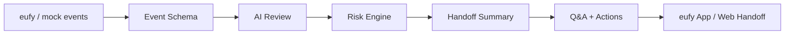

# SentryFlow AI

**SentryFlow AI 是面向 Anker / eufy 智能安防黑客松的 AI 安防交接服务。**

## 产品一句话

```text
eufy 摄像头的晨间安防交接。
```

SentryFlow AI 把 eufy 摄像头的一夜告警整理成晨间摘要、事件解释、误报说明、风险原因、建议动作和处置状态，让用户早上只处理真正重要的一件事。

## 核心场景

```text
闭店后一夜 47 条告警，早上只处理 1 件事。
```

主 Demo：

```text
eufy Morning Handoff
47 条告警 -> 1 个清楚动作
47 alerts -> 1 clear action
```

示例流程：

```text
47 条夜间告警
-> 44 条忽略：雨水、车灯、昆虫、普通运动
-> 2 条解释：员工返回取货等可解释事件
-> 1 条处理：后门 02:13 陌生人停留 38 秒
-> 用户通知店长复核并关闭交接
```

## 解决的问题

传统摄像头已经能完成“看见”和“提醒”，但没有解决“告警之后怎么办”。

SentryFlow AI 进一步回答：

```text
昨晚发生了什么？
哪些不用管？
哪一件必须处理？
为什么有风险？
现在该通知谁、检查哪里、关闭什么状态？
```

## 核心用户

| 用户 | 痛点 | SentryFlow AI 给他的结果 |
| --- | --- | --- |
| 小商铺老板 | 告警太多，早上担心漏掉真正风险 | 47 条告警里，只看 1 件要处理的事 |
| 仓库管理员 | 夜间无人值守，后门和围栏需要优先级 | 知道哪个摄像头、哪个区域今天先检查 |
| eufy App 用户 | 不想每天翻历史告警 | 每天早上收到一份 Daily Security Handoff |

## 产品闭环

```text
1. eufy 摄像头产生夜间运动事件，或 Demo 播放模拟事件流。
2. 系统把事件统一成 Event Schema。
3. AI 复核截图、时间、区域和设备状态。
4. Risk Engine 判断 ignored / explained / action_needed。
5. Handoff Summary 生成晨间交接摘要。
6. 用户询问 AI：昨晚有什么异常？今天先处理哪里？
7. 用户点击通知店长、安排巡检或标记已复核。
8. 状态从 Action needed 变成 Assigned / Handoff closed。
```

## 产品输出

- **晨间摘要**：昨晚整体是否安全，47 条告警如何归类。
- **事件解释**：后门 02:13 发生了什么。
- **误报说明**：雨水、反光、昆虫、普通路过为什么忽略。
- **风险原因**：营业外时间、敏感区域、人员停留时间较长。
- **建议动作**：检查后门门锁，通知店长复核画面。
- **处置状态**：Action needed / Assigned / Reviewed / Handoff closed。

## Demo 入口

当前原型：

```text
prototype/handoff-agent.html
```

浏览器可直接打开，也可以用本地静态服务访问：

```bash
python3 -m http.server 8080
```

然后访问：

```text
http://localhost:8080/prototype/handoff-agent.html
```

Demo 展示：

- `47 / 44 / 2 / 1` 晨间交接总览。
- 后门 02:13 高风险事件。
- 风险原因和建议动作。
- AI 问答。
- 通知店长 / 安排巡检 / 标记已复核。
- 处置状态变化。

## 技术路径



技术原则：

- 不把方案绑死在某个 SDK。
- SDK 可用时接真实 eufy 事件。
- SDK 不可用时使用模拟事件流保证 Demo 稳定。
- 同一套 Event Schema 支撑真实路径和演示路径。

## 产品边界

当前版本明确不做：

- 不做重型 CCTV 平台。
- 不做完整 NVR。
- 不做大型安防指挥中心。
- 不做生产级多摄像头调度。
- 不承诺官方 eufy SDK 已经接入。
- 不替代安保责任人。
- 不自动做最终安全裁决。

AI 的角色是复核、解释和交接。高风险或不确定事件仍需人工复核。

## 当前材料

| 材料 | 用途 |
| --- | --- |
| [最终产品设计](docs/00-产品定位-final-product-design.md) | 产品定位、用户、核心场景、完整路径、产品输出和边界 |
| [技术架构](docs/06-工程架构-technical-architecture.md) | 系统模块、数据结构、SDK/模拟双路径和实现方案 |
| [AI Review 规则](docs/15-ai-review-rules.md) | AI 输入、输出、风险分类、问答边界和评委追问口径 |
| [技术实现计划](docs/16-technical-implementation-plan.md) | 工程任务拆分、Task 1-5 Demo 主路径、API 与 adapter 预留 |
| [页面规格](docs/17-page-spec.md) | 晨间总览、事件列表、详情、问答、处置状态和技术展示的设计开发规格 |
| [截图清单](docs/18-screenshot-shot-list.md) | Pitch、提交页和 Demo Video 可复用的截图素材清单 |
| [边界披露](docs/19-limitations-disclosure.md) | SDK、模拟事件流、AI 安全裁决和人工复核边界 |
| [Demo Video 脚本](docs/20-demo-video-storyboard.md) | 90 秒和 3 分钟录屏脚本 |
| [最终提交包](docs/21-final-submission-package.md) | GitHub、Pitch、视频、原型、数据、架构、边界和 Q&A 最终索引 |
| [路演脚本](docs/07-路演脚本-demo-script.md) | 3 分钟演示和 90 秒短版讲法 |
| [答辩 Q&A](docs/08-答辩QA-judge-qa.md) | 评委可能追问的定位、技术、SDK、边界问题 |
| [Demo Guide](DEMO-GUIDE-Demo指南.md) | 原型打开方式、现场演示步骤和 fallback |
| [Pitch Deck PDF](pitch/SentryFlow-AI-pitch-deck.pdf) | 预选和路演用 Pitch Deck |
| [Pitch Deck PPTX](pitch/SentryFlow-AI-pitch-deck.pptx) | 可编辑版 Pitch Deck |
| [后续整改任务单](docs/submission-suggestions.md) | 产品规格、原型、数据、API、视频和预选材料补充计划 |

## 当前完成度

已完成：

- 产品主线收敛为 `eufy Morning Handoff`。
- 产品设计稿。
- 技术架构文档。
- Demo Guide。
- 路演脚本。
- 答辩 Q&A。
- Pitch Deck PDF / PPTX。
- 静态 HTML 原型。

待补充：

- 工程化 Demo 数据包：`app/data/events.json` 等。
- API / 数据契约。
- AI Review 规则文档。
- Demo 视频脚本与录屏。
- 预选提交表单文案和最终提交清单。

## v1 与当前版本关系

早期 v1 是“远程能源 / 工业场站 AI 巡检 Agent”，当前不作为参赛主线。

本次参赛主线固定为：

```text
eufy Morning Handoff
让 eufy 摄像头每天早上交代清楚：昨晚发生了什么，风险是否真实，今天先处理什么。
```
