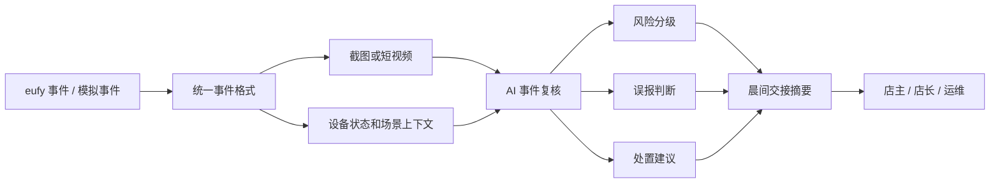

# SentryFlow AI

**SentryFlow AI 是面向 Anker / eufy 智能安防黑客松的 AI 安防交接服务。**

它不再以 v1 的“远程能源/工业场站 AI 巡检平台”作为参赛主线，而是收敛为更贴近 eufy 智能安防赛道、也更容易 24 小时演示的 v2 方向：

```text
把 eufy 摄像头的一夜告警，整理成可复核、可交接、可执行的安全摘要。
```

## 一句话

```text
SentryFlow AI 把 eufy 摄像头从“会报警的设备”，升级成“会交接的值守助手”。
```

主 Demo：

```text
eufy Morning Handoff
47 条告警，最后只告诉你 1 件该处理的事。
From 47 alerts to 1 clear action.
```

## 核心判断

很多小商业、仓库、轻工业和远程边缘资产不是没有摄像头，而是没人有精力持续看摄像头。

传统摄像头会产生大量 motion alerts，但用户真正关心的是：

- 昨晚到底发生了什么？
- 哪些只是雨水、车灯、昆虫、员工活动或误报？
- 哪一个事件今天必须处理？
- 开店、交班或巡检前先看哪里？
- 要不要通知店长、安保、业主或运维人员？

所以 SentryFlow AI 不把重点放在“多识别几个类别”，而是把摄像头事件变成一次清楚的安全交接：

```text
eufy 事件 / 模拟事件
-> AI 复核
-> 风险分级
-> 误报判断
-> 处置建议
-> 晨间交接摘要
-> 用户确认或派发
```

## 目标用户

| 用户 | 痛点 | SentryFlow AI 给他的结果 |
| --- | --- | --- |
| 小商铺老板 | 告警太多，不想每天翻监控 | 早上 30 秒读完安全交接 |
| 仓库管理员 | 夜间无人值守，后门和围栏风险难判断 | 只看需要处理的事件和证据 |
| 小型工厂/轻工业负责人 | 设备区、后门、低光、遮挡等风险容易漏 | 获得优先级和处置建议 |
| 农场/远程资产负责人 | 现场分散，不想每次异常都派人跑现场 | 先远程确认哪里真的要查 |
| eufy 渠道/安装商 | 摄像头套餐同质化，需要增值服务 | 把硬件套餐升级成 AI 值守交接套餐 |

## 产品闭环

```text
1. 店主绑定一个小商铺/仓库/远程资产点位。
2. eufy 摄像头产生运动事件，或 Demo 播放模拟事件流。
3. 系统读取事件截图、短视频、时间、位置和设备状态。
4. AI 判断事件类型、风险等级、误报可能和证据点。
5. 系统把 47 条告警压缩成 1 条待处理动作。
6. 店主收到晨间交接卡：昨晚是否安全，今天先处理什么。
7. 店主点击“已复核 / 通知店长 / 安排巡检”，完成闭环。
```

示例交接卡：

```text
Good morning. Your store was mostly safe last night.

47 alerts reviewed.
44 ignored as rain/light/insects.
2 explained as staff activity.
1 needs attention: back gate, 02:13 AM.

Recommended action:
Check the back gate lock before opening.
```

## 商业价值

SentryFlow AI 的机会不是证明“AI 视频分析没人做”，而是证明 eufy 可以把原本偏企业级、项目制的 AI 视频能力，变成小商业也买得起、装得起、用得懂的轻量产品。

核心价值：

```text
少看：不用翻几十条 motion alerts。
少跑：不用每次异常都派人去现场。
少漏：真正风险不会被雨水、车灯、昆虫、员工活动淹没。
```

商业入口：

- 不单卖一个复杂软件平台。
- 不正面硬拼 Hikvision / Dahua / Milesight 这类重型方案。
- 更适合成为 eufy 摄像头、安装套餐或 App 功能的 AI 增值层。

## 参赛 Demo 范围

24 小时内优先做一个稳定闭环，不追求完整 App。

必做：

1. 模拟 eufy 事件流。
2. 3 个样例事件：后门夜间停留、低光/遮挡、暴雨后远程资产异常。
3. 事件详情页：画面、AI 判断、风险、误报原因、建议动作。
4. 晨间交接摘要：47 条告警 -> 1 条待处理动作。
5. 问答面板：回答“昨晚有什么异常”“今天先处理哪里”。
6. 轻量通知/交接卡模拟：表达用户不是登录后台，而是收到结果。

增强：

- 现场若 eufy SDK/API 可用，接真实事件。
- 若 SDK/API 不稳定，继续用模拟事件流保证 Demo。
- 太阳能/储能场站作为高价值扩展样例，不作为唯一主叙事。

## 技术路径



技术原则：

- 先做事件抽象层，不把方案绑死在某个 SDK。
- SDK 可用时接真实 eufy 事件。
- SDK 不可用时用模拟事件流证明同一套产品闭环。
- MVP 用轻量流程，不上重型多 Agent 编排框架。

## 文档入口

Core materials:

1. [v2 最终产品设计](docs/v2-design/00-final-product-design.md)  
   完整产品稿：产品定位、用户、商业、Demo、技术和 task list。
2. [v2 技术架构与实现方案](docs/v2-design/06-technical-architecture.md)  
   面向开发实现，包含模块、数据结构、API、AI Prompt、SDK/模拟双路径和 24 小时实现顺序。
3. [v2 设计过程文档](docs/v2-design/README.md)  
   策略评审、市场调研、方案收敛、Demo 故事和技术演示方案。
4. [v1 原始产品方向](docs/v1-design/README.md)  
   早期能源/工业场站巡检方向，保留为长期愿景和扩展素材。
5. [参赛规则](参赛规则.md)  
   官方赛题资料整理。

## 版本关系

| 版本 | 定位 | 当前用途 |
| --- | --- | --- |
| v2 | eufy AI 安防交接服务 | 本次参赛主线 |
| v1 | 远程能源 / 工业场站 AI 巡检 Agent | 长期愿景和扩展素材 |

最终判断：

```text
参赛用 v2。
v1 不删除，但只作为未来扩展和第二场景素材。
```
