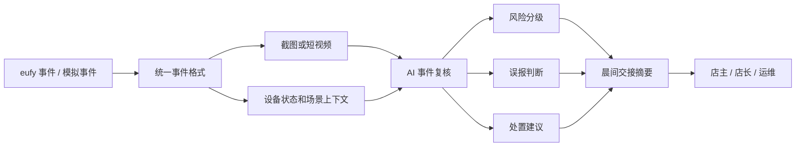

# 05 技术与演示方案

目标：整合策略判断、市场调研、方案设计和 Demo 故事，形成可用于比赛准备、技术说明和路演表达的收口材料。

## 1. 最终判断

当前方向没有跑偏，但必须从“远程能源/工业 AI 视频平台”收敛为：

```text
SentryFlow AI：面向小商业、仓库、轻工业和远程边缘资产的 eufy AI 安防交接服务。
```

太阳能/储能场站适合作为高价值 Demo 样例或扩展场景，不适合作为唯一主叙事。主线应该先让评委理解：普通摄像头已经能报警，但用户真正缺的是把一夜的告警整理成可复核、可交接、可执行的结果。

一句话定位：

```text
把企业级 AI 安防的“事件复核与交接”，下放到小商业和远程资产。
```

## 2. 主办方/评审真正想看到的东西

评审不会只看模型识别了多少类别，而会看这个作品是否能把 eufy 摄像头变成一个新角色。

他们真正想看到的是：

| 评审关注点 | SentryFlow AI 应该怎么回答 |
| --- | --- |
| 是否贴 eufy | 从 eufy 摄像头的运动事件、夜视、设备状态、4G/太阳能、PTZ、本地 AI 和 HomeBase 能力出发。 |
| 是否是真场景 | 选择闭店后的小商铺/小仓库，而不是泛泛地做视频分析平台。 |
| 是否有闭环 | 事件触发 -> AI 复核 -> 风险分级 -> 处置建议 -> 次日交接摘要。 |
| 是否 24 小时能做 | SDK 可用接真实设备；SDK 不可用用模拟 eufy 事件流和样例画面完成稳定演示。 |
| 是否有商业想象 | 不单卖软件，而是把摄像头安装套餐升级成 AI 值守交接套餐。 |

最适合在路演中反复强调的价值：

```text
少看：不用翻几十条 motion alerts。
少跑：不用每次异常都派人去现场。
少漏：真正风险不会被雨水、车灯、昆虫、员工活动淹没。
```

## 3. 最推荐项目切入点

推荐主切入点：

```text
eufy Morning Handoff
把闭店后一夜的摄像头告警，变成早上 30 秒能读完的安全交接。
```

推荐主 Demo 故事：

```text
闭店后的 47 条告警。
47 条告警，最后只告诉你 1 件该处理的事。
From 47 alerts to 1 clear action.
```

这个故事最稳，因为它不依赖马来西亚，也不依赖能源场站，全球小商业都能理解；同时又能自然接到马来西亚本地 CCTV 安装市场和远程资产场景。

扩展故事：

```text
暴雨后的太阳能小站。
少跑一次现场，先知道哪里真的要查。
```

它用于体现马来西亚热带天气、太阳能资源和远程边缘资产的高价值场景，但不要讲成大型工业平台。

## 4. 产品调研和市场调研重点清单

后续准备不需要继续无限调研，应集中补强能进入 PPT 和 Demo 的证据。

| 优先级 | 调研项 | 为什么重要 | 输出形式 |
| --- | --- | --- | --- |
| P0 | 比赛现场 eufy 设备/SDK/API 能力边界 | 决定能否接真实事件、截图、视频片段、设备状态 | 一页能力清单：可接 / 不可接 / 用模拟 |
| P0 | eufy 现有安防能力 | 证明方案贴 eufy，不是通用 CCTV AI | 产品能力表：运动事件、夜视、4G/太阳能、本地存储、每日摘要 |
| P0 | 马来西亚本地 CCTV 套餐形态 | 证明切入点是“安装包升级”，不是孤立软件 | 4/8/16 路套餐、安装、售后、品牌、价格区间 |
| P1 | 本地 AI CCTV 竞品能力 | 避免说“别人做不到”，改说“别人太重/太项目制” | 竞品对比表：企业级平台 vs 轻量交接 |
| P1 | 中国成熟竞品能力 | 证明基础识别不是差异化 | 能力边界表：人形、宠物、越界、跌倒、声光报警等 |
| P1 | 小商业/仓库/轻工业痛点 | 支撑“少看、少跑、少漏” | 用户场景卡：老板、店长、仓管、运维 |
| P2 | 太阳能/储能边缘资产样例 | 增强马来西亚和能源场景记忆点 | 扩展 Demo 卡：暴雨后、遮挡、镜头污渍、设备区异常 |

路演里要避免的说法：

```text
不要说：马来西亚没有 AI CCTV。
应该说：AI CCTV 已经存在，但多偏企业级平台和项目制集成；eufy 的机会是把事件复核与交接做成轻量、可购买、可交付的小商业套餐升级项。
```

## 5. 24 小时黑客松可落地技术方案

### 5.1 真正的技术重点

SentryFlow AI 真正的技术重点应该是：

```text
eufy 事件流
  -> 事件归一化
  -> 多模态复核
  -> 场景规则
  -> 风险排序
  -> 交接摘要
  -> 用户问答 / 处置建议
```

这条链路的价值在于：它不把 AI 停留在“识别画面”，而是把摄像头事件变成用户能行动的交接结果。

真正难的是这几个技术点：

1. 事件降噪：几十条 motion alerts 里，哪些根本不值得打扰用户。
2. 风险排序：不是每个异常都报警，而是判断今天最该处理什么。
3. 场景理解：同样是“有人”，员工返回取货和陌生人后门停留完全不同。
4. 交接生成：把碎片事件变成老板、店长、运维能直接读懂的结论。
5. 低成本部署：不能要求客户上 NVR、服务器、安防平台和专人值守。

### 5.2 MVP 必做闭环

```text
eufy 事件或模拟事件
  -> 事件截图/短视频
  -> AI 事件复核
  -> 风险分级
  -> 误报判断
  -> 处置建议
  -> 晨间交接摘要
  -> 用户问答
```

### 5.3 轻量级展示闭环

比赛 Demo 不建议优先做完整 App。完整 App 会消耗大量时间在注册、账号、权限、设备管理和页面细节上，反而削弱核心价值。

更适合 24 小时黑客松的展示形式是：

```text
网页工作台 + 手机通知/短信模拟 + 注册绑定手机号
```

用户闭环如下：

```text
1. 店主输入手机号，绑定一个 demo 场所。
2. eufy 摄像头产生事件，或系统播放模拟事件流。
3. 系统自动完成事件降噪、风险排序和交接摘要。
4. 系统向手机号发送一条晨间交接通知，或在 Demo 中模拟短信/WhatsApp 通知。
5. 店主点开链接，进入轻量网页交接页。
6. 店主看到：昨晚是否安全、唯一待处理事件、建议动作。
7. 店主点击“已复核 / 通知店长 / 安排巡检”，闭环结束。
```

推荐的 Demo 形式：

| 入口 | 作用 | 24 小时建议 |
| --- | --- | --- |
| 手机号注册 | 表达低门槛，不需要企业账号和复杂平台 | 必做，可以是前端模拟 |
| 晨间通知 | 表达“少看、少跑、少漏”的触达方式 | 必做，可模拟短信/WhatsApp |
| 网页交接页 | 展示完整事件复核和行动建议 | 必做 |
| eufy App 集成 | 表达未来产品化方向 | 路演讲，不强做 |
| 真短信发送 | 增强真实感 | 有时间再做，可用 Twilio/短信服务 |

最推荐的现场演示脚本：

```text
评委输入手机号
  -> 点击“开始昨晚事件回放”
  -> 页面显示 47 条告警被压缩成 1 个待处理动作
  -> 手机通知区出现一条模拟短信
  -> 点击短信链接进入交接页
  -> 询问系统：今天先处理哪里？
  -> 系统回答：先检查后门门锁，并复核 02:13 画面
  -> 点击“已安排店长复核”
  -> 状态从 Action needed 变成 Handoff closed
```

这就是闭环：不是系统分析完就结束，而是把结果送到负责人手里，并让负责人完成确认或派发。

### 5.4 为什么不是一开始做 App

App 是最终产品形态之一，但不是比赛现场最优解。

| 方案 | 优点 | 风险 | 建议 |
| --- | --- | --- | --- |
| 完整 App | 产品感强 | 24 小时内容易陷入登录、设备绑定、推送权限、UI 细节 | 不作为 MVP 主路径 |
| 短信/WhatsApp 通知 + 网页交接页 | 轻、快、闭环清晰，评委容易体验 | 真短信服务可能受网络和账号限制 | 作为主 Demo |
| eufy App 内功能概念 | 最贴产品生态 | 现场难真正集成 | 用原型表达未来方向 |
| 纯后台 Dashboard | 好做 | 不像轻量产品，容易变平台 | 只作为演示工作台，不作为用户主入口 |

最终建议：

```text
比赛现场做“通知即入口”的轻量闭环。
未来产品化时，再把同样能力放进 eufy App 的 Morning Handoff / Daily Security Handoff 功能里。
```

### 5.5 必做功能

| 模块 | 24 小时必须完成的版本 |
| --- | --- |
| 事件输入 | 本地 `events.json` + 样例图片/视频；如果 SDK 可用再替换真实事件源。 |
| 事件复核 | 对每条事件输出：发生了什么、风险等级、是否可能误报、证据点。 |
| 交接摘要 | 汇总昨晚事件，输出“已忽略 / 已确认 / 待处理”的交接清单。 |
| 行动建议 | 对最高风险事件给出下一步：检查门锁、通知值班、安排巡检、远程复核。 |
| 问答面板 | 支持问：“昨晚有什么异常？”“今天先处理哪里？”“哪些是误报？” |
| Demo 页面 | 一个屏幕看完整闭环：总览、事件、画面、建议、交接。 |

### 5.6 增强功能

| 增强项 | 适合什么时候做 |
| --- | --- |
| 真实 eufy 设备接入 | 官方现场提供稳定 SDK/API 或设备资源时。 |
| 多摄像头关联 | MVP 完成后，用于表现轨迹或同一事件合并。 |
| 太阳能/储能扩展事件 | 路演需要马来西亚高价值场景时加入。 |
| App 通知模拟 | Demo 已稳定后，用于增强产品感。 |
| 本地隐私模式说明 | 有时间时放入产品亮点，强化 eufy 信任优势。 |
| 真短信/WhatsApp 发送 | 账号和网络条件允许时，用于替代模拟通知。 |

### 5.7 SDK/API 可用方案

如果现场官方提供 SDK/API：

```text
SDK 事件监听
  -> motion/person/device-state event
  -> snapshot/clip
  -> SentryFlow Event Schema
  -> AI Handoff Service
  -> UI + handoff summary
```

需要优先确认：

- 是否能拿到运动事件。
- 是否能拿到事件截图或短视频。
- 是否能拿到设备状态，例如在线、电量、夜视、灯光、位置。
- 是否允许触发灯光、警报、PTZ 或 App 通知。

### 5.8 SDK/API 不可用兜底方案

如果 SDK/API 不可用：

```text
本地模拟 eufy 事件流
  -> 固定样例截图/视频
  -> 同样的 Event Schema
  -> 同样的 AI 分析和交接 UI
```

兜底方案不是退路，而是黑客松稳定性的核心。它能保证 24 小时内 Demo 不被硬件、网络和权限拖垮，同时保留真实设备接入位。

## 6. 当前架构原型

轻量版原型已整理为：

```text
prototype 目录下的轻量交接原型页面
```

它不是一个大而全的安防平台，而是一个“一屏完成交接”的产品原型：

- 顶部给结论：47 条告警压缩成 1 个待处理动作。
- 左侧列事件：低风险、误报、员工活动、高风险。
- 中间看证据：事件画面、风险解释、证据点。
- 右侧给动作：今天先处理什么、谁需要复核。
- 底部解释轻量：事件驱动、可模拟接入、不依赖 NVR、不做重平台。

### 6.1 轻量架构图



### 6.2 为什么是真轻量

轻量不是功能少，而是部署边界清楚：

| 不做什么 | 做什么 |
| --- | --- |
| 不做完整 NVR 平台 | 只接事件、截图、短视频和设备状态。 |
| 不做大型安防指挥中心 | 只服务小商业、仓库、轻工业和远程边缘资产负责人。 |
| 不要求用户盯实时多路视频 | 把夜间事件压缩成早上可读的交接摘要。 |
| 不替代本地安装商 | 作为摄像头套餐的 AI 增值层。 |
| 不赌官方 SDK 一定可用 | 同一套事件格式支持真实 SDK 和模拟事件流。 |

## 7. 路演故事线

### 7.1 开场 30 秒

```text
很多小商业不是没有摄像头，而是没人有精力看摄像头。
闭店后一夜 47 条 motion alerts，老板第二天真正需要知道的，可能只有一件事。
```

### 7.2 产品 45 秒

```text
SentryFlow AI 把 eufy 摄像头的运动事件、截图和设备状态，整理成一份晨间安全交接：
哪些是雨水、车灯、昆虫或员工活动，哪些是真风险，今天开门前先处理什么。
```

### 7.3 Demo 90 秒

```text
第一步，看总览：47 条告警，44 条低风险，2 条已解释，1 条待处理。
第二步，点开后门事件：02:13 陌生人停留 38 秒，建议开门前检查门锁。
第三步，询问系统：昨晚有什么异常？它直接给出交接摘要和优先动作。
第四步，切到太阳能小站样例：暴雨后发现镜头污渍和局部遮挡，建议先远程复核再派人。
```

### 7.4 商业价值 45 秒

```text
AI 视频分析已经存在，真正的机会是产品形态。
企业级 AI CCTV 太重，消费级摄像头太偏家庭。
eufy 可以把普通摄像头套餐升级成“有人值守感”的轻量安防服务：
少看、少跑、少漏。
```

### 7.5 收尾 20 秒

```text
我们不是多做一个报警功能。
我们让 eufy 摄像头每天早上交代清楚：昨晚发生了什么，风险是否真实，今天先处理什么。
```

## 8. 后续可复用事实

| 编号 | 事实 | 用途 |
| --- | --- | --- |
| F-FINAL-001 | 主方向是 eufy AI 安防交接服务，不是工业 CCTV AI 平台。 | 所有路演和文档标题统一。 |
| F-FINAL-002 | 机会不是 AI 视频分析空白，而是轻量产品形态空位。 | 竞品对比和商业价值表达。 |
| F-FINAL-003 | 马来西亚适合作为轻量升级市场，不应被描述成没有 AI CCTV 的空白市场。 | 市场分析和问答防守。 |
| F-FINAL-004 | 太阳能/储能是高价值扩展样例，不是主叙事唯一依赖。 | Demo 第二场景和差异化补强。 |
| F-FINAL-005 | SDK/API 公开可用性未确认，必须保留模拟事件流兜底。 | 技术方案和 24 小时计划。 |
| F-FINAL-006 | 核心卖点是少看、少跑、少漏。 | 路演金句和产品价值。 |
