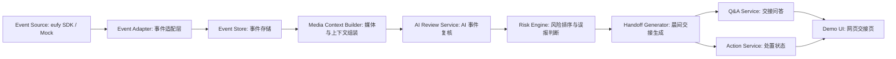

# 06 技术架构与实现方案

SentryFlow AI v2 的工程实现方案，覆盖系统模块、数据流、接口设计、AI 调用、SDK/模拟双路径和 24 小时实现顺序。

## 1. 架构总览

SentryFlow AI v2 的技术核心不是做完整监控平台，而是做一条事件交接流水线：

```text
eufy 事件 / 模拟事件
-> 事件归一化
-> 媒体与上下文组装
-> AI 事件复核
-> 规则和风险排序
-> 晨间交接生成
-> 问答和处置闭环
-> Demo UI 展示
```

整体架构：



## 2. Technology Stack

24 小时黑客松以稳定演示为第一优先级。

| 层 | 技术选型 | 原因 |
| --- | --- | --- |
| 前端 | 现有 `prototype/handoff-agent.html` 或轻量 Vite + React | 先保证一屏 Demo，可后续重构 |
| 后端 | Python FastAPI | 写接口快，适合 AI 调用和 JSON 处理 |
| 数据 | 本地 JSON 文件 | 不上数据库，降低部署成本 |
| AI 调用 | 多模态模型 + 文本模型 | 多模态看图，文本生成交接摘要和问答 |
| 任务编排 | 普通函数流水线 | 不上 LangGraph / CrewAI，避免现场复杂度 |
| 部署 | 本地启动或单机 Web 服务 | 现场演示可控 |

如果团队更熟 Node.js，也可以用 Express 替代 FastAPI。关键不是框架，而是数据结构和闭环稳定。

## 3. Repository Structure

工程结构：

```text
SentryFlow-AI/
  README.md
  docs/
    v2-design/
      00-产品定位-final-product-design.md
      06-工程架构-technical-architecture.md
  prototype/
    handoff-agent.html
    index.html
  app/
    main.py
    api/
      routes_events.py
      routes_handoff.py
      routes_qa.py
      routes_actions.py
    core/
      config.py
      schemas.py
    adapters/
      mock_event_adapter.py
      eufy_event_adapter.py
    services/
      event_service.py
      media_context_service.py
      ai_review_service.py
      risk_engine.py
      handoff_service.py
      qa_service.py
      action_service.py
    data/
      events.json
      reviewed_events.json
      handoff_summary.json
      actions.json
    assets/
      samples/
        back_gate_intrusion.jpg
        warehouse_low_light.jpg
        solar_after_rain.jpg
```

24 小时 MVP 最小目录：

```text
app/main.py
app/data/events.json
app/services/ai_review_service.py
app/services/handoff_service.py
prototype/handoff-agent.html
```

## 4. 核心数据模型

### 4.1 原始事件 RawEvent

RawEvent 是从 eufy SDK 或模拟事件流来的原始事件。目标是尽量贴近摄像头事件，而不是直接写死业务判断。

```json
{
  "event_id": "evt_001",
  "source": "simulated_eufy_event",
  "site_id": "site_store_001",
  "site_type": "small_store",
  "camera_id": "BackGate-01",
  "camera_area": "back_gate",
  "timestamp": "2026-10-16T02:13:00+08:00",
  "trigger": "motion_detected",
  "media": {
    "snapshot_url": "/assets/samples/back_gate_intrusion.jpg",
    "clip_url": null
  },
  "device_state": {
    "online": true,
    "battery": 78,
    "network": "4G",
    "night_vision": true,
    "light": "off",
    "privacy_zone_enabled": true
  },
  "context": {
    "business_hours": "09:00-21:00",
    "is_after_hours": true,
    "sensitive_area": true
  }
}
```

### 4.2 AI 复核结果 ReviewedEvent

ReviewedEvent 是 AI 和规则层处理后的事件结果。

```json
{
  "event_id": "evt_001",
  "event_type": "after_hours_person_stay",
  "risk_level": "high",
  "confidence": 0.86,
  "false_positive_likelihood": "low",
  "scene_summary": "A person stayed near the back gate after closing time.",
  "risk_reason": "The event happened after business hours in a sensitive back-gate area, and the person remained for 38 seconds.",
  "evidence_points": [
    "after business hours",
    "person visible near back gate",
    "sensitive area",
    "stayed longer than normal passing motion"
  ],
  "recommended_action": [
    "Check the back gate lock before opening",
    "Ask the store manager to review the 02:13 clip"
  ],
  "needs_human_review": true,
  "handoff_status": "action_needed"
}
```

### 4.3 交接摘要 HandoffSummary

```json
{
  "handoff_id": "handoff_2026_10_17_store_001",
  "site_id": "site_store_001",
  "period": {
    "start": "2026-10-16T21:00:00+08:00",
    "end": "2026-10-17T08:00:00+08:00"
  },
  "total_alerts": 47,
  "ignored_alerts": 44,
  "explained_alerts": 2,
  "action_needed": 1,
  "top_risk_event_id": "evt_001",
  "summary_text": "Your store was mostly safe last night. 47 alerts were reviewed. 44 were ignored as rain, light or insects, 2 were explained as staff activity, and 1 needs attention at the back gate.",
  "recommended_next_action": "Check the back gate lock before opening and ask the manager to review the 02:13 clip.",
  "status": "action_needed"
}
```

### 4.4 用户动作 Action

```json
{
  "action_id": "act_001",
  "event_id": "evt_001",
  "action_type": "assign_review",
  "assignee": "store_manager",
  "note": "Please review the 02:13 back gate clip before opening.",
  "status": "assigned",
  "created_at": "2026-10-17T08:20:00+08:00"
}
```

## 5. 服务模块设计

### 5.1 Event Adapter

职责：把不同来源的事件转成统一 RawEvent。

输入来源：

- `MockEventAdapter`：读取本地 `events.json`。
- `EufyEventAdapter`：预留真实 SDK/API 接入。

接口概念：

```python
class EventAdapter:
    def list_events(self, site_id: str, start: str, end: str) -> list[RawEvent]:
        ...
```

24 小时内先实现 MockEventAdapter。

### 5.2 Media Context Builder

职责：把图片/视频、设备状态、场景规则拼成 AI 可理解的上下文。

输出内容：

- 图片或关键帧路径。
- 事件时间。
- 摄像头区域。
- 是否营业外。
- 是否敏感区域。
- 设备状态。

### 5.3 AI Review Service

职责：对单个事件做 AI 复核。

输入：RawEvent + 媒体上下文。

输出：ReviewedEvent。

Prompt 应强调：

- 不只识别画面，而是判断是否值得交接。
- 必须输出结构化 JSON。
- 必须说明误报可能。
- 必须给出下一步动作。
- 不确定时标记人工复核，不夸大风险。

### 5.4 Risk Engine

职责：对所有 ReviewedEvent 做排序和降噪。

规则示例：

| 规则 | 分数影响 |
| --- | --- |
| 营业外 + 后门/围栏/设备区 | 风险升高 |
| 人员停留超过阈值 | 风险升高 |
| 雨水、车灯、昆虫、反光 | 风险降低 |
| 员工活动且时间接近关店 | 风险降低或解释为已解释 |
| 摄像头低光、遮挡、离线 | 标记设备风险 |
| 暴雨后设备区可见性下降 | 标记远程资产检查项 |

输出分类：

```text
ignored
explained
action_needed
device_issue
asset_check
```

### 5.5 Handoff Service

职责：生成晨间交接摘要。

输入：排序后的 ReviewedEvent 列表。

输出：HandoffSummary。

摘要模板：

```text
Good morning. Your {site_name} was mostly safe last night.

{total_alerts} alerts reviewed.
{ignored_alerts} ignored as rain/light/insects.
{explained_alerts} explained as staff activity.
{action_needed} needs attention: {camera_area}, {time}.

Recommended action:
{recommended_next_action}
```

### 5.6 Q&A Service

职责：基于 ReviewedEvent 和 HandoffSummary 回答用户问题。

MVP 可先做固定问题映射：

- 昨晚有什么异常？
- 今天先处理哪里？
- 哪些是误报？
- 哪个摄像头问题最多？
- 是否需要派人去现场？

后续再接 LLM 做自由问答。

### 5.7 Action Service

职责：处理用户动作。

动作类型：

```text
mark_reviewed
assign_review
notify_manager
schedule_inspection
ignore_false_positive
close_handoff
```

MVP 只需要在本地 JSON 里更新状态。

## 6. API 设计

最小 API：

| 方法 | 路径 | 作用 |
| --- | --- | --- |
| GET | `/api/events` | 获取原始或复核后事件列表 |
| POST | `/api/review/run` | 运行事件复核流水线 |
| GET | `/api/handoff/today` | 获取今日晨间交接摘要 |
| POST | `/api/qa` | 提交问题并返回回答 |
| POST | `/api/actions` | 创建用户处置动作 |
| PATCH | `/api/actions/{id}` | 更新动作状态 |

### 6.1 POST `/api/review/run`

请求：

```json
{
  "site_id": "site_store_001",
  "period": "last_night"
}
```

响应：

```json
{
  "reviewed_events": 47,
  "ignored_alerts": 44,
  "explained_alerts": 2,
  "action_needed": 1,
  "handoff_id": "handoff_2026_10_17_store_001"
}
```

### 6.2 GET `/api/handoff/today`

响应：

```json
{
  "total_alerts": 47,
  "ignored_alerts": 44,
  "explained_alerts": 2,
  "action_needed": 1,
  "summary_text": "Your store was mostly safe last night...",
  "recommended_next_action": "Check the back gate lock before opening.",
  "top_event": {
    "event_id": "evt_001",
    "camera_area": "back_gate",
    "risk_level": "high",
    "snapshot_url": "/assets/samples/back_gate_intrusion.jpg"
  }
}
```

### 6.3 POST `/api/qa`

请求：

```json
{
  "question": "今天先处理哪里？",
  "handoff_id": "handoff_2026_10_17_store_001"
}
```

响应：

```json
{
  "answer": "先检查后门门锁，并请店长复核 02:13 的后门画面。"
}
```

### 6.4 POST `/api/actions`

请求：

```json
{
  "event_id": "evt_001",
  "action_type": "assign_review",
  "assignee": "store_manager",
  "note": "Please review the 02:13 back gate clip."
}
```

响应：

```json
{
  "action_id": "act_001",
  "status": "assigned"
}
```

## 7. 前端页面实现

MVP 前端采用一屏交接页：

```text
顶部：晨间交接结论
左侧：事件列表和分类
中间：事件画面与 AI 解释
右侧：建议动作和处置按钮
底部：问答面板 / 技术说明
```

页面状态：

1. `Ready`：等待开始昨晚事件回放。
2. `Reviewing`：显示 47 条事件正在复核。
3. `Action needed`：显示 1 条待处理事件。
4. `Assigned`：用户点击通知店长或安排巡检。
5. `Handoff closed`：完成交接。

关键交互：

- `开始昨晚事件回放`
- `查看待处理事件`
- `询问：今天先处理哪里？`
- `通知店长复核`
- `标记交接完成`

## 8. AI Prompt 设计

### 8.1 事件复核 Prompt

```text
你是 SentryFlow AI 的安防交接助手。

请根据摄像头截图/视频帧、事件时间、摄像头位置和设备状态，判断这个事件是否需要进入晨间交接。

你不是只做目标识别，而是要判断：
1. 发生了什么。
2. 这是不是风险。
3. 是否可能是误报。
4. 用户今天需要做什么。

请只返回 JSON：
{
  "event_type": "...",
  "risk_level": "low|medium|high|critical",
  "confidence": 0.0,
  "false_positive_likelihood": "low|medium|high",
  "scene_summary": "...",
  "risk_reason": "...",
  "evidence_points": ["..."],
  "recommended_action": ["..."],
  "needs_human_review": true
}

如果不确定，不要夸大风险，标记 needs_human_review=true。
```

### 8.2 交接摘要 Prompt

```text
你是 SentryFlow AI，正在为小商业负责人生成晨间安全交接。

请基于事件复核结果，用简洁、可执行的语言总结：
- 昨晚是否基本安全。
- 共复核多少条告警。
- 多少条被忽略为误报或低风险。
- 多少条已解释为员工或正常活动。
- 哪一条需要处理。
- 今天开店前建议先做什么。

语气要像交接，不像报警。
不要夸大不确定风险。
```

### 8.3 问答 Prompt

```text
你是 SentryFlow AI 的交接问答助手。

请只基于 handoff summary 和 reviewed events 回答用户问题。
如果用户问今天先处理哪里，请给出最高优先级事件和具体动作。
如果用户问哪些是误报，请解释被忽略事件的原因。
如果资料不足，请说明需要人工复核。
```

## 9. SDK / 模拟双路径

### 9.1 路径 A：真实 eufy 接入

适用条件：现场官方提供 SDK/API、设备、账号或事件接口。

优先接入顺序：

1. 运动事件。
2. 截图或短视频。
3. 摄像头 ID 和位置。
4. 设备在线、电量、夜视、灯光状态。
5. PTZ、灯光、警报等控制能力。

工程策略：

- 真实 SDK 只写在 `adapters/eufy_event_adapter.py`。
- 后续服务只接统一 RawEvent。
- 不让 SDK 细节污染 AI 和 UI 层。

### 9.2 路径 B：模拟事件流

适用条件：SDK 不可用、网络不稳定、账号/权限不确定。

工程策略：

- 本地 `events.json` 模拟 47 条告警。
- 用固定图片/视频表达三类核心事件。
- 同样走 RawEvent -> ReviewedEvent -> HandoffSummary。
- UI 不区分真实事件和模拟事件，只显示 source。

模拟不是临时凑数，而是为了保证黑客松现场 Demo 稳定。

## 10. 24 小时实现顺序

### 0-2 小时：骨架和数据

- 建 FastAPI 或静态前端骨架。
- 定义 RawEvent / ReviewedEvent / HandoffSummary JSON。
- 准备 47 条模拟事件。
- 准备 3 张样例图或视频占位。

### 2-6 小时：事件复核和交接生成

- 实现 MockEventAdapter。
- 实现 AI Review Service 的 mock 版本或真实模型调用。
- 实现 Risk Engine。
- 实现 Handoff Service。

### 6-12 小时：前端 Demo

- 做一屏交接 UI。
- 展示总览、事件列表、证据、建议动作。
- 加入交接状态变化。
- 加入问答面板固定问题。

### 12-18 小时：AI 增强和路演体验

- 接入真实多模态/文本模型。
- 调整 prompt，保证输出稳定 JSON。
- 加入模拟通知卡。
- 加入太阳能小站扩展事件。

### 18-24 小时：稳定和演练

- 固定 Demo 数据。
- 准备 SDK 可用/不可用两套说法。
- 录屏或截图备份。
- 演练 3 分钟路演脚本。
- 确保离线或弱网时也能展示主闭环。

## 11. 风险和兜底

| 风险 | 影响 | 兜底 |
| --- | --- | --- |
| eufy SDK 不可用 | 无法接真实设备 | 用 MockEventAdapter 继续跑完整闭环 |
| 多模态模型输出不稳定 | JSON 解析失败 | 预置 reviewed_events.json，模型只作为增强 |
| 网络不稳定 | AI 调用失败 | 本地固定结果 + 解释为离线演示数据 |
| UI 做不完 | Demo 不完整 | 单页静态 HTML 展示完整流程 |
| 样例图片不足 | 事件不真实 | 用占位图 + 清晰文本证据，后续替换素材 |
| 真短信发不出 | 通知体验弱 | 页面内模拟手机通知卡 |

## 12. MVP 完成标准

比赛前最低完成标准：

- 能从模拟事件流开始跑。
- 能展示 47 条告警被压缩成 1 条待处理动作。
- 能点开待处理事件看到证据、风险原因和建议动作。
- 能生成晨间交接摘要。
- 能回答“今天先处理哪里”。
- 能点击一个处置按钮，让状态进入 closed 或 assigned。
- 能清楚解释 SDK 可用和不可用两条路径。

如果这些都完成，就已经是一个完整可演示的 v2 技术闭环。
