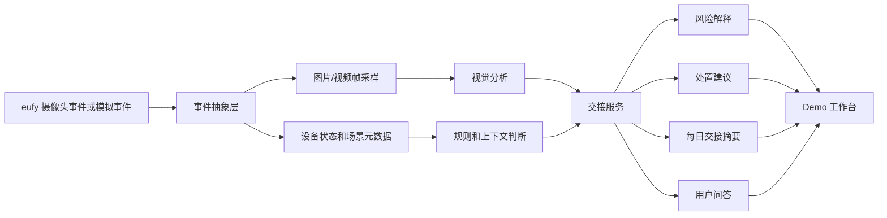

# 方向收敛与 24 小时方案

目标：基于策略评审和市场调研的确定性结果，收敛项目方向，并设计 24 小时黑客松可落地方案。

## 1. 承接的已有判断

本部分不重新做市场调研，而是接收前两轮已经形成的共识：

| 编号 | 已确认或高可信判断 | 本部分处理 |
| --- | --- | --- |
| F-STR-001 | Anker / eufy 智能安防赛道强调真实场景、硬件结合、AI 理解和可演示闭环。 | 沿用，作为候选方向评分核心。 |
| F-SDK-001 | 公开资料未确认 eufy Security 有稳定完整的第三方官方开放 SDK/API。 | 作为技术方案硬约束，必须设计 SDK 可用和不可用两条路径。 |
| F-EUFY-002 | eufy 已有夜视、4G/太阳能、360 度 PTZ、本地 AI、本地存储、跨摄像头追踪、每日报告等能力。 | 作为产品方案的能力基础，但不假设这些能力都可被 SDK 调用。 |
| F-CN-002 | 中国竞品基础识别能力已经成熟，包括人形、宠物、哭声、区域入侵、声光报警等。 | 不把“识别更多类别”作为核心卖点。 |
| F-MY-003 | 马来西亚 AI CCTV 已存在，机会不是能力空白，而是产品形态空位。 | 不宣称竞品做不到，只强调 eufy 的轻量产品化切口。 |
| F-OPP-001 | 推荐方向应从“远程能源场站平台”调整为“小商业、仓库、轻工业和远程边缘资产的 eufy AI 安防交接服务”。 | 作为本部分主推荐方向。 |
| F-MY-SOLAR-002 | 能源方向不一定只讲安防，也可讲能源资产守护/运维交接。 | 保留为高价值 Demo 样例和扩展叙事。 |

## 2. 对已有冲突的处理结果

| 已有冲突 | 本部分处理 |
| --- | --- |
| SDK/API 不确定，不能默认接入官方 SDK。 | 技术架构从“事件抽象层”开始，路径 A 接官方 SDK，路径 B 用模拟事件流兜底。 |
| 当前项目过重地绑定远程能源场站，可能离 eufy 主心智太远。 | 主方向改为“小商业、仓库、轻工业和远程边缘资产”，太阳能/储能作为高价值样例。 |
| 基础 AI 识别已经成熟，不能作为差异化核心。 | 服务 定义从“识别能力”改成“交接服务”，重点是事件复核、风险解释、行动摘要。 |
| 马来西亚不是 AI CCTV 空白市场。 | 不讲“别人没有”，改讲“现有方案偏重，eufy 有机会做轻量产品化”。 |
| 能源场景不应只讲入侵安防。 | 能源样例加入热带天气、遮挡、暴雨后可见性、设备区异常和远程状态交接。 |

## 3. 候选方向评分

评分：5 分最高，1 分最低。

| 方向 | 主办方匹配 | eufy 硬件匹配 | AI 增量 | 市场切入 | 竞品差异 | 24 小时可落地 | 拿奖潜力 | 总分 |
| --- | --- | --- | --- | --- | --- | --- | --- | --- |
| A. 小商业/仓库 AI 安防交接服务 | 5 | 5 | 4 | 5 | 4 | 5 | 5 | 33 |
| B. 远程太阳能/储能资产守护服务 | 4 | 4 | 5 | 4 | 5 | 3 | 4 | 29 |
| C. 家庭/小商业误报复核与每日摘要 服务 | 5 | 5 | 3 | 4 | 2 | 5 | 3 | 27 |
| D. 工厂/轻工业安全合规 服务 | 3 | 3 | 4 | 4 | 3 | 3 | 3 | 23 |
| E. 宠物/儿童/老人看护 服务 | 5 | 5 | 3 | 3 | 1 | 5 | 3 | 25 |

### 3.1 A. 小商业/仓库 AI 安防交接服务

这是最稳的主方向。它贴 eufy 智能安防赛道，也能承接马来西亚本地 home / office / factory / store / farm 的摄像头安装基础。

它的核心不是“检测到人”，而是把闭店后、夜间和无人值守期间的事件，整理成店主、仓库管理员或远程资产负责人第二天能处理的交接清单。

### 3.2 B. 远程太阳能/储能资产守护服务

这是最有差异化的方向，但也最容易讲重。它适合作为 Demo 样例或扩展场景，用来证明 eufy 不只服务家庭，也能进入远程边缘资产。

如果把它作为主方向，必须避免讲成工业平台；更好的表达是“小型太阳能/储能站的无人值守交接”。

### 3.3 C. 家庭/小商业误报复核与每日摘要 服务

最贴 eufy 现有心智，也最容易做，但竞品同质化较强。中国竞品已经把家庭看护、宠物、老人、儿童等场景做得很细，拿奖张力不如 A。

### 3.4 D. 工厂/轻工业安全合规 服务

有商业价值，但容易进入专业安防和工业安全合规领域，24 小时内很难做出可信完整闭环。适合作为后续扩展，不适合作为比赛主线。

### 3.5 E. 宠物/儿童/老人看护 服务

很贴 eufy 赛道示例，但竞争太拥挤，除非有非常强的情感体验和演示设计，否则不建议作为主方向。

## 4. 最推荐切入点

推荐主方向：

```text
eufy AI 安防交接服务
面向小商业、仓库、轻工业和远程边缘资产。
```

推荐 Demo 样例：

```text
马来西亚小仓库/小商铺闭店后无人值守。
太阳能/储能场站作为第二个高价值样例或扩展场景。
```

最核心的产品判断：

```text
AI 视频分析不是空白；空位在轻量化产品形态。
SentryFlow AI 不和企业级平台拼重能力，而是把 eufy 摄像头升级成小场景负责人能直接使用的交接入口。
```

## 5. AI 能力 产品定义

### 5.1 产品一句话

```text
SentryFlow AI 把 eufy 摄像头的夜间和闭店后事件，整理成一份可复核、可交接、可执行的安全摘要。
```

### 5.2 目标用户

- 小商铺店主
- 仓库管理员
- 小型工厂/轻工业场地负责人
- 农场或偏远资产负责人
- 小型太阳能/储能站运维负责人
- eufy 海外渠道和本地安装服务商

### 5.3 需要解决的问题

这些用户通常不是没有摄像头，而是没有精力持续看摄像头。

系统要回答：

- 昨晚发生了什么？
- 哪些事件值得处理？
- 哪些可能是误报？
- 哪个区域风险最高？
- 今天开店、巡检或交班前应该先看哪里？
- 是否需要通知店员、安保、业主或运维人员？

### 5.4 核心能力

| 能力 | 用户价值 | 是否 MVP |
| --- | --- | --- |
| 事件理解 | 把运动事件、截图和视频片段解释成自然语言 | 必做 |
| 风险分级 | 区分普通运动、可疑停留、禁区进入、设备区异常 | 必做 |
| 误报复核 | 标记低置信、遮挡、动物、反光、天气等可能误报 | 必做 |
| 处置建议 | 给出通知、复核、忽略、加入日报等下一步 | 必做 |
| 每日交接摘要 | 面向店主/管理员生成闭店后安全交接 | 必做 |
| 自然语言问答 | 回答“昨晚有什么异常”“哪个摄像头问题最多” | 增强 |
| 多摄像头关联 | 合并同一时间段或同一人员轨迹 | 增强 |
| 能源资产检查 | 遮挡、暴雨后可见性、设备区异常等 | 增强或样例 |

## 6. 24 小时 MVP 范围

### 6.1 必须做成的闭环

```text
模拟 eufy 摄像头事件
  -> 事件截图/短视频
  -> AI 分析事件
  -> 风险分级和误报判断
  -> 给出处置建议
  -> 生成闭店后/夜间交接摘要
  -> 用户可问“昨晚发生了什么”
```

### 6.2 MVP 三个演示事件

| 事件 | 场景 | 展示价值 |
| --- | --- | --- |
| 后门夜间进入 | 小商铺或仓库后门 | 最直观，贴智能安防赛道 |
| 摄像头遮挡/低光 | 仓库或设备区 | 体现不是只看人，还看设备可用性 |
| 暴雨后设备区可见性异常 | 小型太阳能/储能场站 | 体现马来西亚天气和能源资产样例 |

### 6.3 MVP 页面

1. `今日交接总览`  
   展示昨晚事件数、高风险、待复核、摄像头异常、建议优先级。

2. `事件详情`  
   展示截图/视频片段、AI 解释、风险等级、误报判断、建议动作。

3. `交接摘要`  
   自动生成给店主/管理员/运维负责人的简短摘要。

4. `问答面板`  
   用户问：“昨晚有什么异常？”“今天先处理哪里？”“哪些可能是误报？”

## 7. 技术架构图



## 8. 路径 A：SDK/API 可用方案

前提：比赛现场官方提供可用 SDK/API，能访问至少一部分摄像头事件、截图、视频片段或设备状态。

### 8.1 数据接入

- 监听运动事件、人员检测事件、设备状态事件。
- 获取事件关联截图或短视频片段。
- 获取摄像头 ID、位置、时间、夜视/灯光/在线状态等元数据。

### 8.2 事件抽象

统一转成内部事件格式：

```json
{
  "event_id": "evt_001",
  "site_type": "small_warehouse",
  "camera_id": "back_gate_01",
  "camera_area": "back_gate",
  "timestamp": "2026-10-16T22:14:00+08:00",
  "source": "eufy_sdk",
  "trigger": "motion_detected",
  "media": {
    "snapshot_url": "...",
    "clip_url": "..."
  },
  "device_state": {
    "online": true,
    "night_vision": true,
    "battery": 82,
    "light": "off"
  }
}
```

### 8.3 AI 分析

- 多模态模型分析截图或关键帧。
- 规则层加入时间、区域、设备状态、营业时间等上下文。
- 系统输出风险解释、置信度、误报可能、建议动作。

### 8.4 输出

- 事件详情卡
- 高风险提醒
- 交接摘要
- 问答结果

## 9. 路径 B：SDK/API 不可用兜底方案

前提：公开资料无法确认 SDK/API，现场接入不稳定或资源晚到。

### 9.1 数据准备

用本地模拟事件流和样例图片/视频替代真实设备：

```text
data/events.json
assets/sample/back_gate_intrusion.jpg
assets/sample/warehouse_low_light.jpg
assets/sample/solar_after_rain.jpg
```

### 9.2 模拟事件格式

```json
{
  "event_id": "demo_001",
  "site_type": "small_warehouse",
  "camera_id": "BackGate-01",
  "camera_area": "后门",
  "timestamp": "22:14",
  "source": "simulated_eufy_event",
  "trigger": "motion_detected",
  "expected_issue": "after_hours_entry",
  "snapshot": "assets/sample/back_gate_intrusion.jpg",
  "device_state": {
    "night_vision": true,
    "battery": 78,
    "network": "4G",
    "privacy_zone_enabled": true
  }
}
```

### 9.3 演示解释方式

路演中不要说“已经接入官方 SDK”。更稳的说法是：

```text
我们先把 eufy 能提供的事件、截图、设备状态抽象成统一事件格式。
如果现场 SDK 可用，事件来自真实设备；
如果 SDK 不稳定，Demo 用模拟 eufy 事件流证明产品闭环。
```

### 9.4 兜底价值

即使没有真实 SDK，也能稳定展示：

- 事件触发
- AI 视觉分析
- 风险解释
- 误报复核
- 处置建议
- 每日交接摘要
- 用户问答

## 10. 24 小时开发优先级

### 10.1 必做功能

| 优先级 | 功能 | 目标 |
| --- | --- | --- |
| P0 | 模拟事件流 | 不依赖 SDK，保证 Demo 能跑 |
| P0 | 事件详情页 | 评委能看到截图、风险、解释、建议 |
| P0 | AI 事件分析 | 输出结构化 JSON：事件类型、风险、原因、建议、复核 |
| P0 | 交接摘要 | 形成“昨晚发生了什么、今天先处理什么” |
| P0 | 三个样例事件 | 后门进入、遮挡/低光、暴雨后设备区异常 |
| P1 | 问答面板 | 支持问“昨晚有什么异常”“哪些是高风险” |
| P1 | eufy 设备状态模拟 | 展示夜视、4G、太阳能、电量、隐私区等 |

### 10.2 增强功能

| 功能 | 价值 | 放弃条件 |
| --- | --- | --- |
| 接真实 SDK/API | 最贴硬件，最有现场说服力 | SDK 文档不清或调试超过 3 小时 |
| 多摄像头关联 | 更像完整产品 | 时间不够时只做两个事件关联 |
| 声光/通知联动 | 强化 eufy 设备感 | 没有硬件权限时做 UI 模拟 |
| 能源资产专属报告 | 强化差异化 | 主 Demo 不稳时降级为扩展卡片 |
| 置信度和误报原因 | 体现专业度 | 模型输出不稳定时用规则兜底 |

## 11. 推荐技术实现

### 11.1 技术栈

- 前端：现有 `prototype/index.html` 可先延展，若重构可用 Vite + React。
- 后端：Python FastAPI 或 Node.js Express，选团队最熟的即可。
- 数据：本地 JSON 文件即可，不上数据库。
- AI：多模态模型分析图片/关键帧，文本模型生成交接摘要和问答。
- 流程编排：不需要上复杂多 服务 框架，MVP 用“事件分析器 + 摘要器 + 问答器”三个模块即可。

### 11.2 为什么不建议一上来用重型编排框架

比赛只有 24 小时，真正要赢的是稳定可演示的产品闭环。

LangGraph / CrewAI / AutoGen 可以作为后续扩展，但现场 MVP 更适合用明确流程：

```text
输入事件 -> 分析事件 -> 生成建议 -> 汇总交接 -> 回答问题
```

## 12. 更新后的后续可复用事实

| 编号 | 结论 | 状态 | 使用提醒 |
| --- | --- | --- | --- |
| F-SOL-001 | 主推荐方向是“面向小商业、仓库、轻工业和远程边缘资产的 eufy AI 安防交接服务”。 | 已确认 | 技术方案 可作为最终推荐方向。 |
| F-SOL-002 | 太阳能/储能场站不作为唯一主叙事，而作为高价值 Demo 样例或扩展场景。 | 已确认 | 可用于路演中的差异化和马来西亚天气故事。 |
| F-SOL-003 | 项目差异化不是基础识别，而是轻量产品化的事件交接体验。 | 已确认 | 路演 中避免说“我们首创 AI 视频分析”。 |
| F-SOL-004 | 技术架构必须同时支持真实 SDK 接入和模拟事件流兜底。 | 已确认 | 24 小时现场开发必须优先保证路径 B 可跑。 |
| F-SOL-005 | MVP 必做三类事件：后门夜间进入、摄像头遮挡/低光、暴雨后设备区可见性异常。 | 较可信 | 技术方案 可根据路演故事再微调。 |
| F-SOL-006 | 服务 产品定义应是“安防交接服务”，不是“视频识别能力”或“工业 CCTV 平台”。 | 已确认 | 后续 README、路演、Demo 文案都应同步修正。 |

## 13. 方案设计 结论

方案设计 推荐把项目从“远程能源场站 AI 巡检”收敛为：

```text
eufy AI 安防交接服务
面向小商业、仓库、轻工业和远程边缘资产。
```

这是当前最稳的拿奖路线：贴 eufy 智能安防赛道，避开中国家庭摄像头同质化，也不和马来西亚企业级 AI CCTV 平台正面硬拼。

太阳能/储能场站保留，但不要讲成重工业平台。它更适合作为“远程边缘资产”的高价值样例，用来展示马来西亚天气、遮挡、暴雨后可见性和远程状态交接。

24 小时 MVP 的第一优先级不是接上所有硬件，而是保证一个稳定闭环：

```text
模拟/真实 eufy 事件 -> AI 理解 -> 风险复核 -> 处置建议 -> 每日交接 -> 用户问答
```
