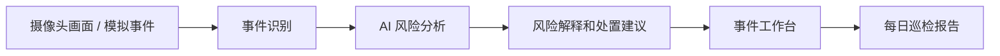

# MVP 目标与产品原型

## MVP 目标

用一个可演示闭环证明：eufy 摄像头不只是“看到画面”，而是可以成为远程能源场站的 AI 巡检员。

MVP 聚焦三个场景：

1. 夜间入侵：有人进入围栏或设备区，系统判断风险并给出处置建议
2. 设备区异常：画面出现遮挡、低光、烟雾 / 火光、异常停留，系统标记风险
3. 自动巡检报告：每天汇总事件次数、风险等级、设备状态、待处理事项

## 原型参考思路

参考工业视频分析、工地安全监控、太阳能场站安防平台的常见设计，MVP 不只做“识别结果”，而是做一个巡检工作台：

- 顶部看场站状态：今天有没有风险、哪类风险最多
- 中间看摄像头和事件：哪个区域出问题、风险等级多高
- 右侧看 AI 解释：发生了什么、为什么危险、建议怎么处理
- 底部看巡检报告：今天哪些事情需要人工跟进

## 用户流程



## 页面 1：场站总览

```text
┌──────────────────────────────────────────────────────────────────────────────┐
│ SentryFlow AI                          场站：Solar Site A       今日 22:30   │
├──────────────────────────────────────────────────────────────────────────────┤
│ 今日状态                                                                      │
│ [总事件 12]  [高风险 3]  [待复核 2]  [摄像头异常 1]  [今日风险：偏高]          │
├───────────────────────────────┬──────────────────────────────────────────────┤
│ 场站摄像头分布                  │ 风险趋势                                      │
│                               │                                              │
│  Gate-01     Fence-02         │ 高风险:  ███                                  │
│  [高风险]     [正常]           │ 中风险:  █████                                │
│                               │ 低风险:  ██                                   │
│  Equip-03    Battery-04       │                                              │
│  [中风险]     [摄像头异常]      │ 今日主要风险：夜间入侵、设备区低光、遮挡        │
├───────────────────────────────┴──────────────────────────────────────────────┤
│ 最新事件                                                                      │
│ 22:14  Gate-01     夜间入侵      高风险      待复核                           │
│ 21:40  Equip-03    低光          中风险      已记录                           │
│ 19:05  Battery-04  遮挡          中风险      待复核                           │
└──────────────────────────────────────────────────────────────────────────────┘
```

这个页面解决的问题：评委和队友一眼知道这是一个“场站巡检系统”，不是普通摄像头播放器。

## 页面 2：三类 MVP 场景卡片

```text
┌──────────────────────────────────────────────────────────────────────────────┐
│ MVP 场景                                                                      │
├───────────────────────┬───────────────────────┬──────────────────────────────┤
│ 场景一：夜间入侵       │ 场景二：设备区异常       │ 场景三：自动巡检报告           │
│                       │                       │                              │
│ 触发条件：             │ 触发条件：             │ 触发条件：                    │
│ 有人进入围栏 / 设备区  │ 遮挡、低光、烟雾火光、  │ 每日定时或手动生成            │
│                       │ 异常停留               │                              │
│ AI 输出：              │ AI 输出：              │ AI 输出：                     │
│ - 是否入侵             │ - 异常类型             │ - 今日事件汇总                │
│ - 风险等级             │ - 影响范围             │ - 高风险事件                  │
│ - 处置建议             │ - 是否需要复核          │ - 待处理事项                  │
│                       │                       │                              │
│ Demo 画面：            │ Demo 画面：            │ Demo 画面：                   │
│ 夜间围栏截图 + 红框     │ 设备区截图 + 异常标签    │ 自动生成日报卡片              │
└───────────────────────┴───────────────────────┴──────────────────────────────┘
```

这个页面解决的问题：把 MVP 拆成三个可分工、可演示、可讲价值的模块。

## 页面 3：事件详情与 AI 处置建议

```text
┌──────────────────────────────────────────────────────────────────────────────┐
│ 事件详情：夜间入侵                                      状态：待人工复核       │
├──────────────────────────────────────┬───────────────────────────────────────┤
│ 现场画面                              │ AI 分析结果                            │
│                                      │                                       │
│  ┌──────────────────────────────┐    │ 事件类型：夜间入侵                     │
│  │                              │    │ 风险等级：高                           │
│  │     [夜间场站截图]            │    │ 摄像头：Gate-01                        │
│  │     人员位置：围栏内设备区     │    │ 时间：22:14                            │
│  │     禁区范围：红色边界框       │    │                                       │
│  └──────────────────────────────┘    │ AI 解释：                              │
│                                      │ 画面中有人进入围栏内设备区，发生时间为 │
│                                      │ 夜间非工作时段，且靠近关键能源设备。   │
│                                      │                                       │
│                                      │ 建议动作：                              │
│                                      │ 1. 通知值班人员远程复核视频片段         │
│                                      │ 2. 如无法确认身份，联系现场安保         │
│                                      │ 3. 将事件写入今日巡检报告               │
│                                      │                                       │
│                                      │ [标记已复核]  [升级告警]  [加入日报]    │
└──────────────────────────────────────┴───────────────────────────────────────┘
```

这个页面解决的问题：体现 AI 不是只给标签，而是能解释原因、推动下一步处理。

## 页面 4：每日巡检报告

```text
┌──────────────────────────────────────────────────────────────────────────────┐
│ 每日巡检报告：Solar Site A                                  2026-09-11       │
├──────────────────────────────────────────────────────────────────────────────┤
│ 今日摘要                                                                      │
│ 今日共发现 12 起事件，其中 3 起高风险、7 起中风险、2 起低风险。                 │
│ Gate-01 出现夜间入侵，Battery-04 摄像头存在遮挡，建议优先处理。                │
├──────────────────────────────────────────────────────────────────────────────┤
│ 风险分布                                                                      │
│ 夜间入侵：3 起      设备区异常：5 起      摄像头状态异常：1 起                 │
├──────────────────────────────────────────────────────────────────────────────┤
│ 待处理事项                                                                    │
│ 1. 复核 Gate-01 夜间入侵事件                                                   │
│ 2. 检查 Battery-04 摄像头遮挡原因                                               │
│ 3. 调整 Equip-03 夜间补光或低光阈值                                             │
├──────────────────────────────────────────────────────────────────────────────┤
│ 建议优先级                                                                    │
│ 高：夜间入侵事件                                                               │
│ 中：设备区低光、遮挡                                                           │
│ 低：普通运动事件                                                               │
└──────────────────────────────────────────────────────────────────────────────┘
```

这个页面解决的问题：把单个事件沉淀成运维人员能直接使用的巡检结果。

## Demo 数据结构

```json
{
  "site": "Solar Site A",
  "camera_id": "Gate-01",
  "camera_area": "围栏入口",
  "time": "22:14",
  "scenario": "夜间入侵",
  "risk_level": "high",
  "status": "待人工复核",
  "scene_summary": "夜间有人进入围栏内设备区。",
  "risk_reason": "人员靠近关键能源设备，且发生在非工作时间，存在盗窃或设备破坏风险。",
  "recommended_action": [
    "通知值班人员远程复核视频片段",
    "如无法确认身份，联系现场安保",
    "将事件加入今日巡检报告"
  ]
}
```

## 黑客松演示顺序

1. 展示场站总览：说明这是远程能源场站，不是家庭客厅场景
2. 触发夜间入侵事件：AI 输出风险解释和处置建议
3. 切到设备区异常：展示遮挡、低光、烟雾 / 火光、异常停留
4. 打开每日巡检报告：展示系统如何把事件沉淀成运维结果

## 队友可分工

- AI / CV：做三类场景识别和结构化输出
- 前端：做场站总览、事件详情、报告页面
- 后端 / IoT：做模拟摄像头事件流、事件存储、报告接口
- 调研 / Pitch：补市场证据、竞品对比、演示故事

