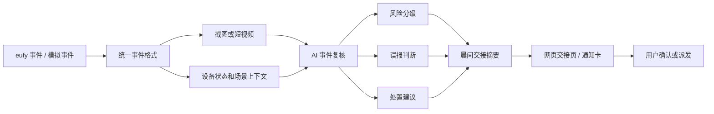

# SentryFlow AI v2 最终产品设计

## 项目名称

**SentryFlow AI**

副标题：

**把 eufy 摄像头的一夜告警，变成早上 30 秒能读完的安全交接。**

## 一句话介绍

SentryFlow AI 是面向小商业、仓库、轻工业和远程边缘资产的 eufy AI 安防交接服务。它不只是识别画面，而是把摄像头事件整理成风险解释、误报判断、处置建议和晨间交接摘要。

## 项目定位

SentryFlow AI 的当前参赛形态不是工业 CCTV 平台，也不是通用家庭看护功能。

它要验证一个更轻、更贴近 eufy 的产品机会：

```text
让 eufy 摄像头从“会报警的设备”，变成“会交接的值守助手”。
```

传统摄像头解决了“看见”和“提醒”，但没有解决“交接”：

- 告警太多，用户不看。
- 误报太多，用户忽略。
- 真风险混在大量普通 motion alerts 里。
- 小商业和仓库没有专人盯后台。
- 远程资产负责人不想每次异常都派人跑现场。

SentryFlow AI 进一步回答：

```text
昨晚发生了什么？
哪些不需要管？
哪一件必须处理？
今天开店、交班或巡检前先做什么？
```

## 产品边界

当前版本只做安防交接，不做大型平台：

- 不做完整 NVR。
- 不做大型安防指挥中心。
- 不做生产级多摄像头调度。
- 不承诺已接入官方 eufy SDK。
- 不把太阳能/储能场站作为唯一主叙事。
- 不和企业级 AI CCTV 平台正面拼重能力。

当前版本重点验证：

- eufy 事件如何被 AI 复核。
- 一夜告警如何被降噪和排序。
- 风险如何被解释成用户能行动的建议。
- 结果如何以交接卡、网页交接页或 App 功能形式送到负责人手里。

## 核心差异

| 普通摄像头/监控平台 | SentryFlow AI |
| --- | --- |
| 产生 motion alerts | 复核和整理 alerts |
| 用户自己翻视频 | 用户只看待处理事件 |
| 强调识别人/车/宠物 | 强调风险、误报和下一步 |
| 登录后台看多路画面 | 收到晨间交接卡 |
| 偏设备或平台 | 偏交接服务 |
| 告诉用户“有事件” | 告诉用户“该怎么处理” |

## 目标用户

### 小商铺老板

典型状态：

- 店里已有摄像头。
- 每天收到大量 motion alerts。
- 半夜不想被打扰，早上又担心漏掉真风险。

关注点：

- 昨晚店铺是否安全。
- 后门、收银台、仓库门口有没有异常。
- 今天开门前是否要检查门锁或通知店长。

SentryFlow AI 给他的结果：

```text
47 条告警里，只有 1 件需要你今天开门前处理。
```

### 仓库管理员

典型状态：

- 夜间无人值守。
- 后门、围栏、装卸区、货架区是重点。
- 告警如果不分优先级，很容易被忽略。

关注点：

- 是否有陌生人停留。
- 是否有员工异常返回取货。
- 摄像头是否被遮挡、低光或离线。

SentryFlow AI 给他的结果：

```text
昨晚哪些事件已解释，哪些需要复核，今天先检查哪里。
```

### 小型工厂/轻工业负责人

典型状态：

- 有设备区、材料区、后门、室外通道。
- 不一定有专职安防团队。
- 需要低成本升级现有摄像头方案。

关注点：

- 设备区是否有人异常停留。
- 夜间画面是否可用。
- 低光、遮挡、烟雾、火光等是否需要人工复核。

SentryFlow AI 给他的结果：

```text
把设备区事件转成优先级和处置建议。
```

### 远程边缘资产负责人

典型状态：

- 农场、小型太阳能/储能站、偏远仓库等现场分散。
- 每次派人去现场都有成本。
- 暴雨、遮挡、镜头污渍和设备区可见性问题会影响判断。

关注点：

- 是否真的需要派人去现场。
- 暴雨后哪些区域要优先检查。
- 摄像头画面是否还能支持远程判断。

SentryFlow AI 给他的结果：

```text
少跑一次现场，先知道哪里真的要查。
```

### eufy 渠道和本地安装商

典型状态：

- 原本卖摄像头、安装和售后。
- 硬件套餐容易同质化。
- 需要更高价值的增值服务。

关注点：

- 怎么把普通摄像头套餐升级。
- 怎么让客户感受到“有人值守感”。
- 怎么不部署重型企业平台，也能提供 AI 能力。

SentryFlow AI 给他的结果：

```text
摄像头 + 安装 + 远程查看 + AI 晨间交接。
```

## 当前验证路径

完整产品未来可以进入 eufy App 或成为安装套餐增值服务，但黑客松阶段优先验证最关键的闭环：

```text
事件输入 -> AI 复核 -> 风险排序 -> 交接摘要 -> 用户确认
```

主硬件/能力假设：

- eufy 摄像头运动事件。
- 事件截图或短视频片段。
- 夜视、4G/太阳能、设备状态、PTZ、灯光、隐私区等能力可作为产品表达。

技术边界：

- 当前公开资料不能确认 eufy Security 有稳定完整的官方开放 SDK/API。
- 因此 MVP 必须同时支持真实 SDK 和模拟事件流。
- 现场如果 SDK 可用，接真实事件；如果不可用，用模拟事件流保证 Demo 稳定。

## 当前可演示原型

当前原型聚焦最容易讲清楚、最适合现场演示的场景：

```text
闭店后的 47 条告警。
```

用户流程：

1. 店主绑定一个 demo 店铺、仓库或远程资产点位。
2. 系统播放昨晚 eufy 模拟事件流。
3. 共出现 47 条告警。
4. AI 复核后判断：
   - 44 条是雨水、车灯、昆虫或普通低风险运动。
   - 2 条是员工活动，已解释。
   - 1 条需要处理：后门 02:13 出现陌生人停留。
5. 系统生成晨间交接摘要。
6. 店主打开交接页，看见证据、风险解释和建议动作。
7. 店主点击“通知店长 / 安排巡检 / 标记已复核”。
8. 交接状态从 `Action needed` 变成 `Handoff closed`。

示例输出：

```text
Good morning. Your store was mostly safe last night.

47 alerts reviewed.
44 ignored as rain/light/insects.
2 explained as staff activity.
1 needs attention: back gate, 02:13 AM.

Recommended action:
Check the back gate lock before opening.
```

## 主 Demo 故事

### 故事一：闭店后的 47 条告警

定位：

```text
eufy Morning Handoff
把一夜的摄像头告警，变成早上 30 秒能读完的安全交接。
```

广告语：

```text
47 条告警，最后只告诉你 1 件该处理的事。
From 47 alerts to 1 clear action.
```

购买理由：

```text
老板买的不是 AI 识别，而是不用再被无效告警折磨，也不会让真正的风险淹没在几十条提醒里。
```

### 故事二：暴雨后的太阳能小站

定位：

```text
eufy Edge Asset Guardian
让远程太阳能/储能资产在暴雨后自动完成状态交接。
```

作用：

- 作为马来西亚和远程边缘资产的高价值样例。
- 展示热带天气、遮挡、镜头污渍、设备区可见性问题。
- 不作为唯一主叙事，避免讲成重工业平台。

### 故事三：不是报警，是交班

定位：

```text
eufy Security Shift Handoff
把摄像头从报警工具，变成会交班的值守同事。
```

作用：

- 用于产品化表达。
- 说明 SentryFlow AI 不是多一个告警，而是每天给出清楚交代。

## 核心功能蓝图

### 1. 事件接入

MVP：

- 本地 `events.json`。
- 样例图片或短视频。
- 模拟 eufy 事件格式。

未来：

- 接入真实 eufy 运动事件。
- 获取截图、短视频、设备状态。
- 接入夜视、灯光、PTZ、隐私区等设备能力。

### 2. AI 事件复核

输入：

- 截图或短视频关键帧。
- 摄像头位置。
- 时间。
- 设备状态。
- 营业时间和场景规则。

输出：

- 事件类型。
- 风险等级。
- 证据点。
- 是否可能误报。
- 推荐动作。
- 是否需要人工复核。

### 3. 风险排序

目标：

- 不把每条异常都报警。
- 把 47 条 motion alerts 排成用户真正需要处理的优先级。

排序因素：

- 时间是否在营业外。
- 区域是否敏感。
- 是否有人停留。
- 是否靠近后门、围栏、设备区。
- 是否可能是天气、昆虫、反光、员工活动。

### 4. 晨间交接摘要

摘要要回答：

- 昨晚是否安全。
- 总共有多少事件。
- 哪些已忽略。
- 哪些已解释。
- 哪一件需要处理。
- 今天先做什么。

### 5. 用户问答

支持问题：

- 昨晚有什么异常？
- 哪些是高风险？
- 哪些可能是误报？
- 今天开门前先处理哪里？
- 哪个摄像头问题最多？
- 是否需要安排现场巡检？

### 6. 处置闭环

用户动作：

- 标记已复核。
- 通知店长。
- 安排巡检。
- 忽略误报。
- 加入日报。

闭环状态：

```text
Action needed -> Assigned -> Reviewed -> Handoff closed
```

## 商业设计

### 机会判断

AI 视频分析不是空白市场。真正的机会是产品形态：

```text
企业级 AI CCTV 太重；
消费级摄像头太偏家庭；
小商业、仓库、轻工业和远程资产缺少轻量、可购买、可交付的值守交接服务。
```

### eufy 的机会

eufy 不需要把自己讲成重型安防平台。

更稳的切入点是：

```text
把普通摄像头套餐升级成“有人值守感”的轻量 AI 安防服务。
```

### 购买理由

用户不是为了买“AI 模型”，而是为了：

- 少看：不用翻几十条告警。
- 少跑：不用每次异常都派人去现场。
- 少漏：真正风险不会被误报淹没。
- 好交接：老板、店长、仓管、运维之间有清楚记录。
- 好升级：安装商可以把 AI 交接作为套餐增值项。

### 收费想象

可选商业形态：

- 摄像头安装套餐升级项。
- eufy App 增值功能。
- 小商业安全交接月费。
- 本地安装商/安防服务商渠道包。
- 远程边缘资产高级样例包。

## 24 小时技术方案

### 总体架构



### 统一事件格式

```json
{
  "event_id": "demo_001",
  "site_type": "small_warehouse",
  "camera_id": "BackGate-01",
  "camera_area": "后门",
  "timestamp": "02:13",
  "source": "simulated_eufy_event",
  "trigger": "motion_detected",
  "snapshot": "assets/sample/back_gate_intrusion.jpg",
  "device_state": {
    "night_vision": true,
    "battery": 78,
    "network": "4G",
    "privacy_zone_enabled": true
  }
}
```

### SDK 可用路径

```text
SDK 事件监听
-> motion/person/device-state event
-> snapshot/clip
-> SentryFlow Event Schema
-> AI Handoff Service
-> UI + handoff summary
```

优先确认：

- 是否能拿到运动事件。
- 是否能拿到事件截图或短视频。
- 是否能拿到在线、电量、夜视、灯光、位置等设备状态。
- 是否允许触发灯光、警报、PTZ 或 App 通知。

### SDK 不可用路径

```text
本地模拟 eufy 事件流
-> 固定样例截图/视频
-> 同样的 Event Schema
-> 同样的 AI 分析
-> 同样的交接 UI
```

兜底方案不是退路，而是黑客松稳定性的核心。

## Demo 页面设计

### 页面 1：晨间交接总览

展示：

- 昨晚总告警数。
- 已忽略误报数。
- 已解释事件数。
- 待处理事件数。
- 今日建议动作。

### 页面 2：事件详情

展示：

- 事件截图或短视频。
- AI 判断。
- 风险等级。
- 误报判断。
- 证据点。
- 建议动作。

### 页面 3：交接摘要

展示：

- 面向老板/店长/仓管的自然语言摘要。
- “昨晚是否安全”。
- “今天先处理什么”。

### 页面 4：问答面板

展示：

- 用户问昨晚情况。
- 系统回答具体事件和行动建议。

## 24 小时 Task List

### P0 必须完成

| 任务 | 产出 | 完成标准 |
| --- | --- | --- |
| 定义模拟事件数据 | `events.json` | 至少 47 条事件，能聚合成 1 条待处理动作 |
| 准备样例素材 | 图片/短视频 | 后门事件、低光/遮挡、暴雨后远程资产异常 |
| 事件分析器 | 结构化 JSON 输出 | 每条事件有类型、风险、误报、原因、建议 |
| 风险排序器 | 排序结果 | 能把低价值告警降噪，把高风险事件置顶 |
| 晨间交接生成器 | 摘要文本 | 能输出“昨晚发生了什么，今天先处理什么” |
| 交接 UI | 单页网页 | 一屏展示总览、事件、证据、建议、状态 |
| 问答面板 | 固定问题问答 | 能回答昨晚异常、优先处理项、误报原因 |
| Demo 脚本 | 3 分钟流程 | 评委能看懂从事件到交接的闭环 |

### P1 增强

| 任务 | 价值 | 放弃条件 |
| --- | --- | --- |
| 模拟通知卡 | 强化“通知即入口”产品感 | UI 来不及时放到页面右侧模拟 |
| eufy 设备状态模拟 | 体现夜视、4G、太阳能、电量、隐私区 | 主闭环不稳时降级 |
| 太阳能小站扩展卡 | 增强马来西亚和远程资产记忆点 | 主 Demo 不稳时只在路演说 |
| 多摄像头关联 | 表现更像完整产品 | 24 小时内不强求 |
| 真短信/WhatsApp | 真实触达感 | 网络、账号或时间不允许时放弃 |
| 真实 SDK 接入 | 最贴硬件 | SDK 文档不清或调试超过 3 小时即放弃 |

### P2 赛后扩展

- 接入真实 eufy SDK/API。
- 进入 eufy App 内功能原型。
- 加入多门店、多仓库、多角色权限。
- 做本地安装商套餐页。
- 做每周/月度安全报告。
- 扩展到农场、小型太阳能/储能站、轻工业园区。

## 路演表达

### 开场 30 秒

```text
很多小商业不是没有摄像头，而是没人有精力看摄像头。
闭店后一夜 47 条 motion alerts，老板第二天真正需要知道的，可能只有一件事。
```

### 产品 45 秒

```text
SentryFlow AI 把 eufy 摄像头的运动事件、截图和设备状态，整理成一份晨间安全交接：
哪些是雨水、车灯、昆虫或员工活动，哪些是真风险，今天开门前先处理什么。
```

### Demo 90 秒

```text
第一步，看总览：47 条告警，44 条低风险，2 条已解释，1 条待处理。
第二步，点开后门事件：02:13 陌生人停留 38 秒，建议开门前检查门锁。
第三步，询问系统：昨晚有什么异常？它直接给出交接摘要和优先动作。
第四步，切到太阳能小站样例：暴雨后发现镜头污渍和局部遮挡，建议先远程复核再派人。
```

### 商业价值 45 秒

```text
AI 视频分析已经存在，真正的机会是产品形态。
企业级 AI CCTV 太重，消费级摄像头太偏家庭。
eufy 可以把普通摄像头套餐升级成“有人值守感”的轻量安防服务：
少看、少跑、少漏。
```

### 收尾 20 秒

```text
我们不是多做一个报警功能。
我们让 eufy 摄像头每天早上交代清楚：昨晚发生了什么，风险是否真实，今天先处理什么。
```

## 和 v1 的关系

v1 是“远程能源/工业场站 AI 巡检 Agent”，有差异化，但对本次比赛偏重。

v2 的处理方式：

```text
参赛主线：小商业/仓库 eufy Morning Handoff。
扩展样例：暴雨后的太阳能小站。
长期愿景：远程能源、轻工业、农场和边缘资产的 AI 交接服务。
```

## 最终结论

SentryFlow AI v2 的核心不是“识别更多画面”，而是“完成一次交接”。

它最适合用下面这句话统一所有材料：

```text
把 eufy 摄像头的一夜告警，变成早上 30 秒能读完的安全交接。
```
